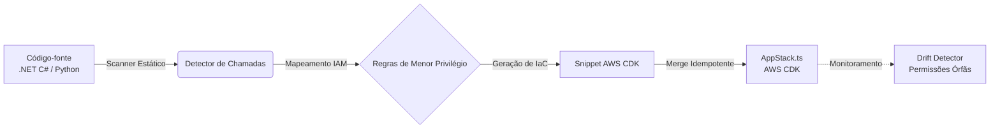

# 🌩️ Kiro Power: AWS Serverless & Infrastructure Auto-Architect

[](https://www.typescriptlang.org/)
[](https://aws.amazon.com/cdk/)
[](SECURITY.md)
[](https://jestjs.io/)
[](https://opensource.org/licenses/MIT)

> **Kiro Power** para a IDE experimental **Kiro da AWS**. Analisa código de aplicação em tempo real (**C# .NET** e **Python boto3**) e gera Infraestrutura como Código (**AWS CDK em TypeScript**) aplicando rigorosamente o princípio de **Menor Privilégio (Least Privilege IAM)**, sem wildcards permissivos (`*`) e com prevenção de *drift*.

---

## 📌 Sumário

- [Visão Geral](#-visão-geral)
- [Problema vs Solução](#-problema-vs-solução)
- [Principais Funcionalidades](#-principais-funcionalidades)
- [Arquitetura e Fluxo](#-arquitetura-e-fluxo)
- [Estrutura do Projeto](#-estrutura-do-projeto)
- [Pré-requisitos e Instalação](#-pré-requisitos-e-instalação)
- [Como Usar](#-como-usar)
  - [Executando a Demonstração](#executando-a-demonstração)
  - [Executando a Suíte de Testes](#executando-a-suíte-de-testes)
  - [Build do Projeto](#build-do-projeto)
- [Exemplo de Transformação](#-exemplo-de-transformação)
- [Configuração](#-configuração)
- [Segurança](#-segurança)
- [Licença](#-licença)

---

## 📖 Visão Geral

Desenvolvedores serverless frequentemente concedem permissões IAM excessivas (`FullAccess`, `*`) durante o desenvolvimento local para evitar erros de autorização ou por complexidade de mapear cada ação do SDK.

O **Kiro Auto-Architect** atua dentro da IDE Kiro como um assistente autônomo de DevSecOps:
1. **Inspeciona** o código da aplicação (.NET e Python) detectando chamadas a SDKs da AWS (`DynamoDB`, `S3`, `SQS`, `SNS`).
2. **Infere** com exatidão as ações de API necessárias (`PutItem`, `GetObject`, `SendMessage`, etc.).
3. **Gera e Mescla** o código TypeScript do AWS CDK diretamente na stack existente de forma não-destrutiva.
4. **Detecta Drift** de permissões quando um método do SDK é removido do código de aplicação.

---

## ⚡ Problema vs Solução

| Abordagem Tradicional | Com Kiro Power Auto-Architect |
| --------------------- | ----------------------------- |
| Políticas amplas como `s3:*` ou `dynamodb:*` | Permissões cirúrgicas como `dynamodb:PutItem` e `s3:GetObject` |
| Erros em runtime por esquecer de vincular ARN | Resolução automática de recursos via variáveis de ambiente e arquivos de configuração |
| S3 Object ARN vs Bucket ARN misturados | Separação estrita: `s3:ListBucket` no Bucket e `s3:PutObject` em `/*` |
| Conflitos e perda de código manual na stack CDK | Merge seguro entre delimitadores `[kiro-power:start]` e `[kiro-power:end]` |
| Permissões órfãs acumuladas na stack | `checkDrift()` identifica permissões não mais utilizadas |

---

## 🎯 Principais Funcionalidades

- **Mapeamento Estrito de SDK para IAM:**
  - **DynamoDB:** `PutItemAsync` &rarr; `dynamodb:PutItem`, `GetItemAsync` &rarr; `dynamodb:GetItem`, `QueryAsync` &rarr; `dynamodb:Query` (com alerta para `ScanAsync`).
  - **Amazon S3:** Tratamento refinado de ARNs (`bucket` para `ListBucket`, `bucket/*` para operações de objetos).
  - **Amazon SQS:** `receive_message` &rarr; `sqs:ReceiveMessage`, `delete_message` &rarr; `sqs:DeleteMessage`.
  - **Amazon SNS:** `publish` &rarr; `sns:Publish`.
- **Merge Idempotente e Não-Destrutivo:** Insere e atualiza código CDK preservando 100% dos recursos definidos manualmente pela equipe.
- **Supressão Flexível de Falsos Positivos:**
  - Inline: Linhas comentadas com `// kiro-ignore` ou `# kiro-ignore`.
  - Global: Regras no arquivo `.kiroignore` e no manifesto `kiro-power.json`.
- **Governança e Tagging Automatizado:** Aplica tags de conformidade (`ManagedBy: kiro-power`, `SecurityLevel: LeastPrivilege`).

---

## 🏗️ Arquitetura e Fluxo



---

## 📁 Estrutura do Projeto

```
.
├── POWER.md                     # Manifesto de capacidades e triggers do Kiro IDE
├── kiro-power.json              # Configuração de governança, tags e destinos IaC
├── .kiroignore                  # Padrões ignorados no scan (testes, mocks, builds)
├── .gitignore                   # Exclusão de arquivos temporários, builds e segredos
├── SECURITY.md                  # Política de segurança e reporte de vulnerabilidades
├── package.json                 # Metadados, scripts e dependências do projeto
├── tsconfig.json                # Configurações do compilador TypeScript
│
├── src/                         # Core Engine do Power
│   ├── types.ts                 # Tipos, interfaces e estruturas de dados
│   ├── index.ts                 # Orquestrador central (KiroAutoArchitectPower)
│   ├── mappings/                # Regras de conversão SDK -> IAM Actions
│   │   ├── dynamodb.ts          # Mapeamentos DynamoDB
│   │   ├── s3.ts                # Mapeamentos S3 (Bucket vs Object ARN)
│   │   ├── sqs.ts               # Mapeamentos SQS
│   │   └── sns.ts               # Mapeamentos SNS
│   ├── scanner/                 # Leitores e parsers de código
│   │   ├── scanner.ts           # Definições base dos scanners
│   │   ├── csharpScanner.ts     # Analisador de chamadas .NET C#
│   │   ├── pythonScanner.ts     # Analisador de chamadas Python (boto3)
│   │   └── configResolver.ts    # Resolução de nomes em appsettings.json e .env
│   ├── generator/               # Geradores de Infraestrutura como Código
│   │   ├── cdkGenerator.ts      # Síntese de CDK com Table.fromTableArn e IAM
│   │   └── merger.ts            # Fusão não-destrutiva via tags delimitadoras
│   ├── drift/                   # Governança contínua
│   │   └── driftDetector.ts     # Identificação de permissões IAM órfãs
│   └── __tests__/               # Testes unitários com Jest
│       └── kiro-power.test.ts   # Cobertura completa de merge, scanners e drift
│
└── examples/                    # Suíte de demonstração prática
    ├── OrdersService.cs         # Exemplo de microsserviço C# (.NET 8)
    ├── NotificationWorker.py    # Exemplo de worker Python (boto3)
    ├── AppStack.ts              # Stack CDK original da equipe
    ├── GeneratedAppStack.ts     # Stack resultante após aplicação do Power
    └── demo_runner.js           # Script de demonstração ponta a ponta
```

---

## 🚀 Pré-requisitos e Instalação

### Pré-requisitos
- **Node.js**: v18 ou superior
- **npm**: v9 ou superior

### Instalação

Clone o repositório e instale as dependências:

```bash
git clone https://github.com/seu-usuario/aws-serverless-auto-architect-power.git
cd aws-serverless-auto-architect-power
npm install
```

> **Nota:** O pacote `aws-cdk-lib` e `constructs` estão inclusos em `devDependencies` para prover suporte e tipagem completos ao código de demonstração e geração de Stacks CDK.

---

## 💻 Como Usar

### Executando a Demonstração

O script `demo_runner.js` executa uma simulação ponta a ponta das 4 fases do Power:

```bash
npm run demo
```

O script realizará:
1. **Scan** em `OrdersService.cs` e `NotificationWorker.py`.
2. **Geração** de statements IAM com menor privilégio.
3. **Merge** seguro dentro de `examples/AppStack.ts` gerando `GeneratedAppStack.ts`.
4. **Verificação de Drift**, simulando a remoção de operações no código.

### Executando a Suíte de Testes

Os testes são executados com **Jest** e **ts-jest**:

```bash
# Rodar todos os testes unitários
npm test

# Modo de observação (watch)
npm run test:watch

# Relatório de cobertura de código
npm run test:coverage
```

### Build do Projeto

Para compilar o código TypeScript para JavaScript distribuível:

```bash
npm run build
```

Os artefatos compilados e arquivos de declaração (`.d.ts`) serão gerados no diretório `dist/`.

---

## 🔍 Exemplo de Transformação

### 1. Código da Aplicação (`OrdersService.cs`)

```csharp
await _dynamoDb.PutItemAsync(new PutItemRequest {
    TableName = "OrdersTable",
    Item = item
});
```

### 2. AWS CDK Gerado Automaticamente

```typescript
// [kiro-power:start]
// Gerado automaticamente pelo Kiro Power: AWS Serverless Auto-Architect
const ordersTable = dynamodb.Table.fromTableArn(
  this,
  'KiroOrdersTable',
  `arn:aws:dynamodb:${this.region}:${this.account}:table/OrdersTable`
);

appFunction.addToRolePolicy(new iam.PolicyStatement({
  actions: ['dynamodb:PutItem'],
  resources: [ordersTable.tableArn],
  effect: iam.Effect.ALLOW,
}));
// [kiro-power:end]
```

---

## ⚙️ Configuração

### `kiro-power.json`

Permite customizar destinos de IaC, tags corporativas e regras de alerta:

```json
{
  "iac": {
    "target": "cdk-typescript",
    "stackFile": "infra/lib/app-stack.ts",
    "defaultLambdaTarget": "appFunction"
  },
  "tagging": {
    "enabled": true,
    "tags": {
      "ManagedBy": "kiro-power:aws-auto-architect",
      "SecurityLevel": "LeastPrivilege"
    }
  },
  "security": {
    "alertOnWildcards": true,
    "requireEncryptionOnS3": true,
    "alertOnDynamoDbScan": true
  }
}
```

### `.kiroignore`

Padrões de arquivos e pastas excluídos do escopo de escaneamento:

```gitignore
bin/
obj/
node_modules/
**/tests/**
**/*Test.cs
**/Mocks/**
```

---

## 🔒 Segurança

Consulte [SECURITY.md](SECURITY.md) para detalhes sobre a política de segurança, diretrizes de menor privilégio e instruções para reporte confidencial de vulnerabilidades.

---

## 📄 Licença

Distribuído sob a licença **MIT**. Consulte o arquivo [LICENSE](LICENSE) para obter mais informações.
