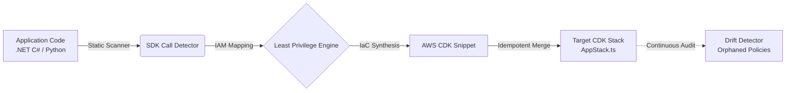

# 🌩️ Kiro Power: AWS Serverless & Infrastructure Auto-Architect

[](https://www.typescriptlang.org/)
[](https://aws.amazon.com/cdk/)
[](SECURITY.md)
[](https://jestjs.io/)
[](LICENSE)

> Autonomous **Kiro Power** for AWS's experimental Kiro IDE. Analyzes application source code in real-time (**C# .NET** and **Python boto3**) to synthesize Infrastructure as Code (**AWS CDK in TypeScript**), strictly enforcing **Least Privilege IAM**, preventing permissive wildcards (`*`), and detecting security drift.

---

## 📌 Table of Contents

- [Overview](#-overview)
- [Problem vs. Solution](#-problem-vs-solution)
- [Key Features](#-key-features)
- [Architecture & Workflow](#-architecture--workflow)
- [Project Structure](#-project-structure)
- [Prerequisites & Installation](#-prerequisites--installation)
- [Getting Started](#-getting-started)
  - [Running the Interactive Demo](#running-the-interactive-demo)
  - [Running Test Suite](#running-test-suite)
  - [Building the Project](#building-the-project)
- [Transformation Example](#-transformation-example)
- [Configuration](#-configuration)
- [Security Policy](#-security-policy)
- [License](#-license)

---

## 📖 Overview

Serverless and cloud developers frequently default to overly broad IAM permissions (`FullAccess`, `*`) during local prototyping to prevent authorization roadblocks or avoid manually mapping complex AWS SDK actions.

**Kiro Auto-Architect** runs within the Kiro IDE environment as an autonomous DevSecOps co-pilot:
1. **Scans** application code (.NET C# and Python) to detect calls to AWS SDKs (`DynamoDB`, `S3`, `SQS`, `SNS`).
2. **Infers** precise API actions (`PutItem`, `GetObject`, `SendMessage`, etc.).
3. **Generates & Merges** TypeScript AWS CDK code into existing stacks in a non-destructive manner.
4. **Detects Drift** by highlighting orphaned IAM permissions whenever SDK calls are removed from application code.

---

## ⚡ Problem vs. Solution

| Traditional Development | With Kiro Power Auto-Architect |
| ----------------------- | ------------------------------ |
| Overly permissive wildcards (`s3:*`, `dynamodb:*`) | Laser-focused permissions (`dynamodb:PutItem`, `s3:GetObject`) |
| Runtime failures due to misconfigured ARNs | Automatic resource and ARN resolution via `.env` and `appsettings.json` |
| S3 Object ARN vs. Bucket ARN conflicts | Strict separation: `s3:ListBucket` on bucket ARN, `s3:PutObject` on `/*` |
| Risk of losing manual CDK stack code during generation | Safe, idempotent merge inside `[kiro-power:start]` and `[kiro-power:end]` tags |
| Accumulation of orphaned IAM permissions | Continuous `checkDrift()` identifies stale, unused permissions |

---

## 🎯 Key Features

- **Strict SDK-to-IAM Mapping:**
  - **DynamoDB:** `PutItemAsync` &rarr; `dynamodb:PutItem`, `GetItemAsync` &rarr; `dynamodb:GetItem`, `QueryAsync` &rarr; `dynamodb:Query` (flags warnings for `ScanAsync`).
  - **Amazon S3:** Granular ARN handling (`arn:aws:s3:::bucket` for `ListBucket`, `arn:aws:s3:::bucket/*` for object operations).
  - **Amazon SQS:** `receive_message` &rarr; `sqs:ReceiveMessage`, `delete_message` &rarr; `sqs:DeleteMessage`.
  - **Amazon SNS:** `publish` &rarr; `sns:Publish`.
- **Non-Destructive & Idempotent Merging:** Injects synthesized CDK constructs into target stacks while preserving 100% of the team's manual code.
- **Flexible False-Positive Suppression:**
  - Inline: Comment lines with `// kiro-ignore` or `# kiro-ignore`.
  - Global: Exclusions via `.kiroignore` and the `kiro-power.json` manifest.
- **Compliance & Automated Tagging:** Injects standardized organizational tags (`ManagedBy: kiro-power`, `SecurityLevel: LeastPrivilege`).

---

## 🏗️ Architecture & Workflow



---

## 📁 Project Structure

```
.
├── POWER.md                     # Kiro IDE Power activation & capability manifest
├── kiro-power.json              # Governance, tagging, and IaC target configuration
├── .kiroignore                  # File/folder ignore patterns (tests, mocks, build)
├── .gitignore                   # Version control ignore list
├── SECURITY.md                  # Security policy and vulnerability disclosure guide
├── LICENSE                      # MIT license file
├── package.json                 # Project dependencies, scripts, and metadata
├── tsconfig.json                # TypeScript compiler configuration
│
├── src/                         # Core Power Engine
│   ├── types.ts                 # Data models, interfaces, and shared types
│   ├── index.ts                 # Main orchestrator (KiroAutoArchitectPower)
│   ├── mappings/                # SDK-to-IAM action translation matrices
│   │   ├── dynamodb.ts          # DynamoDB permission rules
│   │   ├── s3.ts                # S3 Bucket vs Object ARN rules
│   │   ├── sqs.ts               # SQS permission rules
│   │   └── sns.ts               # SNS permission rules
│   ├── scanner/                 # Code analyzers & config parsers
│   │   ├── scanner.ts           # Base scanner definitions
│   │   ├── csharpScanner.ts     # .NET C# source code parser
│   │   ├── pythonScanner.ts     # Python (boto3) source code parser
│   │   └── configResolver.ts    # Config resolution (.env, appsettings.json)
│   ├── generator/               # Infrastructure as Code generators
│   │   ├── cdkGenerator.ts      # CDK synthesizer (Table.fromTableArn, IAM statements)
│   │   └── merger.ts            # Non-destructive stack merger
│   ├── drift/                   # Continuous security drift detection
│   │   └── driftDetector.ts     # Identifies orphaned IAM permissions
│   └── __tests__/               # Unit test suite (Jest)
│       └── kiro-power.test.ts   # Comprehensive coverage for scanners, merger & drift
│
└── examples/                    # End-to-end demonstration assets
    ├── OrdersService.cs         # Sample .NET 8 microservice with AWS SDK
    ├── NotificationWorker.py    # Sample Python worker with boto3
    ├── AppStack.ts              # Team's original AWS CDK stack
    ├── GeneratedAppStack.ts     # Resulting CDK stack post-merger
    └── demo_runner.js           # End-to-end demonstration runner script
```

---

## 🚀 Prerequisites & Installation

### Prerequisites
- **Node.js**: v18.x or higher
- **npm**: v9.x or higher

### Installation

Clone the repository and install all dependencies:

```bash
git clone https://github.com/your-username/kiro-aws-auto-architect.git
cd kiro-aws-auto-architect
npm install
```

> **Note:** `aws-cdk-lib` and `constructs` are included in `devDependencies` to provide complete TypeScript typings for your CDK stacks and example code.

---

## 💻 Getting Started

### Running the Interactive Demo

Run the end-to-end demonstration script to see all four phases of the Power in action:

```bash
npm run demo
```

The script performs:
1. **Scan**: Inspects `OrdersService.cs` and `NotificationWorker.py`.
2. **IaC Generation**: Synthesizes least-privilege IAM statements.
3. **Merge**: Non-destructively injects code into `examples/AppStack.ts` generating `GeneratedAppStack.ts`.
4. **Drift Detection**: Simulates code modifications to reveal orphaned permissions.

### Using the CLI & Slash Commands

You can execute the Power commands directly via `npm run` or the `auto-architect` CLI:

```bash
# Scan workspace for AWS SDK calls (.NET C# and Python)
npm run scan
# or: npx auto-architect scan

# Synthesize and merge least-privilege CDK constructs into target stack
npm run apply
# or: npx auto-architect apply

# Audit target stack for orphaned IAM permissions (drift detection)
npm run drift
# or: npx auto-architect drift
```

### Running Test Suite

Run the unit tests powered by **Jest** and **ts-jest**:

```bash
# Run all tests
npm test

# Run tests in watch mode
npm run test:watch

# Generate coverage report
npm run test:coverage
```

### Building the Project

Compile TypeScript into JavaScript and output type definitions (`.d.ts`):

```bash
npm run build
```

The compiled output will be generated inside the `dist/` directory.

---

## 🔍 Transformation Example

### 1. Application Code (`OrdersService.cs`)

```csharp
await _dynamoDb.PutItemAsync(new PutItemRequest {
    TableName = "OrdersTable",
    Item = item
});
```

### 2. Auto-Generated AWS CDK Code

```typescript
// [kiro-power:start]
// Generated automatically by Kiro Power: AWS Serverless Auto-Architect
const ordersTable = dynamodb.Table.fromTableArn(
  this,
  'KiroOrdersTable',
  `arn:aws:dynamodb:${this.region}:${this.account}:table/OrdersTable`
);

appFunction.addToRolePolicy(new iam.PolicyStatement({
  actions: ['dynamodb:PutItem'],
  resources: [ordersTable.tableArn],
  effect: iam.Effect.ALLOW,
}));
// [kiro-power:end]
```

---

## ⚙️ Configuration

### `kiro-power.json`

Customize target stacks, enterprise tags, and security alerts:

```json
{
  "iac": {
    "target": "cdk-typescript",
    "stackFile": "infra/lib/app-stack.ts",
    "defaultLambdaTarget": "appFunction"
  },
  "tagging": {
    "enabled": true,
    "tags": {
      "ManagedBy": "kiro-power:aws-auto-architect",
      "SecurityLevel": "LeastPrivilege"
    }
  },
  "security": {
    "alertOnWildcards": true,
    "requireEncryptionOnS3": true,
    "alertOnDynamoDbScan": true
  }
}
```

### `.kiroignore`

Ignore paths and file patterns during scanning:

```gitignore
bin/
obj/
node_modules/
**/tests/**
**/*Test.cs
**/Mocks/**
```

---

## 🔒 Security Policy

For security vulnerability disclosure procedures, least privilege guarantees, and ARN scoping details, please review [SECURITY.md](SECURITY.md).

---

## 📄 License

This project is licensed under the **MIT License**. See the [LICENSE](LICENSE) file for details.
